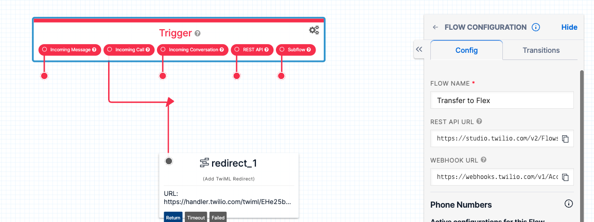

# Conversation Relay & Flex

This repository contains prototype packages for Twilio Conversation Relay (CR) with an agent handoff to Twilio Flex.

These examples are built upon Twilio's Serverless Functions and generally require utilization of the Twilio CLI.

&nbsp;

## Architecture

There are two primary parts of this demonstration package.  They are:
- Conversation Relay Websocket server 
- Function & Studio Flow for agent handoff 

>NOTE: In a development/testing environment there are three (3) processes running to support a demonstration in DEV.  These are: (1) The CR websocket server (node application) runs locally on port 3000; (2) A separate process is used to host the Twilio Function responsible for agentHandoff.  This uses the Twilio CLI and runs on port 3001; and (3) A final process is used to start the Flex UI with the plugin.  This also uses the Twilio CLI and Flex plugin running on port 3002.

We will be deploying the Conversation Relay Server and adding the agent handoff during this lab. 

This is the typical architecture that reflects the communications between the Flex UI (plugin) and the Twilio Cloud (Serverless Functions).

&nbsp;

  
&nbsp;

## Prerequisites

- Twilio CLI (command line interface) : [CLI Quickstart Guide](https://www.twilio.com/docs/twilio-cli/quickstart)
- Twilio Serverless & Flex Plugin : [CLI Plugins](https://www.twilio.com/docs/twilio-cli/plugins)
- A New Flex Account
- Code editor of choice ( e.g. Visual Studio Code)


## Configure/Test/Deploy

Perform the following steps to configure, test and deploy this Twilio Flex plugin and supporting Twilio Functions.  
&nbsp;

### Step 1 : Create a new Flex Account

1. Use the Twilio Console to create a new Flex Account if you do not already have one. Test that you can navigate to "Flex" and "Login with Console" before proceeding. 

2. Agree to the [Flex Fair Usage Policy](https://www.twilio.com/console/flex/fair-usage-policy)

3. Enable Voice AI features in the Twilio Console. Navigate to Voice / Programmable Voice, select General under Settings, and turn on the predictive and Generative AI/ML features Addendum.

&nbsp;

#### Exploring your Flex Account

1. Familiarize yourself with the Flex agent and administrator views by following [this guide](https://www.twilio.com/docs/flex/onboarding-guide/explore-the-built-in-flex-ui-views).

2. Navigate to your Phone Numbers in the Twilio Console. Click on the phone number in your account to configure it. You should see a section for Voice Configuration and Messaging Configuration. 

3. Set "A call comes in" to "Studio Flow" and set the flow as "Voice IVR" 

4. Set "A message comes in" to "Studio Flow" and set the flow as "Messaging Flow". Save the configuration. 

5. Now navigate to Studio. Click into Voice IVR and Messaging Flow to see how each incoming task routes to Flex. 

6. Login to Flex as an agent (Flex -> Overview -> Log in with console) and set yourself to "Available", and send an SMS or trigger a voice call to your phone number. *Note that outgoing SMS will fail because the phone number associated with your account has not been registered for SMS. Learn more about SMS errors and troubleshooting in the Twilio console by navigating to Monitor -> Insights -> Messages.


### Step 2 : Install Twilio CLI (command line interface)


1. Install CLI using the official [Twilio CLI Quickstart](https://www.twilio.com/docs/twilio-cli/quickstart)
```
brew install twilio
```
2. Install the CLI plugins for serverless and Flex [CLI Plugins](https://www.twilio.com/docs/twilio-cli/plugins)
```
twilio plugins:install @twilio-labs/plugin-serverless
```
```
twilio plugins:install @twilio-labs/plugin-flex
```
3. Create a [CLI profile](https://www.twilio.com/docs/twilio-cli/general-usage))

```
twilio profiles:create
```

4. Set CLI active profile

```
twilio profiles:use <ProfileName>
```

&nbsp;

### Step 3 : Install/Config of the Conversation Relay App ( socket server )

Follow the instructions in the [README](/apps/convRelayApp/README.md) file for the CR App.
 
 ### Step 4: Import the example Studio Flow 

1. Navigate to Twilio Studio and create a new Flow. Name it something like "Transfer to Flex".

2. Scroll down and select import from JSON. Then copy the JSON from the example [Studio Flow](/docs/studio.json).

3. Select the Redirect widget and update the URL to the ngrok URL for your conversation relay app. Example: `https://[your-ngrok-subdomain].ngrok.app/twiml`.

4. Select the "SendCalltoAgent" widget and Select "Assign to Anyone" under the Workflow dropdown. 

5. Save and publish your studio flow. 

6. Click on the "Trigger" box to view your Flow Configuration. 


7. Copy the "Webhook URL" to your .env file for `STUDIO_FLOW_URL` within the convRelay folder. 

8. Navigate back to your phone numbers and select "Studio Flow" under "A call comes in". Select the Flow you just created under "Flow. 

9. Now you're ready to launch your Conversation Relay server once more by running 
```
node index.js
```

&nbsp;

### Testing your Transfer

1. In the Twilio console, search for or navigate to "Flex" and select "Log in with Console"

2. In the upper right corner, set your agent to "Available"

3. Call your Twilio phone number once more. Feel free to chat with your AI Assistant, but eventually you should ask to be transferred to a human. 

4. If all works as planned, you should see an incoming task in your Flex UI. Accept it, and talk to yourself if you'd like. You should plan to mute one or both participants. 

## Enable Copilot Wrap-Up Notes
Increase agent productivity with automated wrap-up notes and topic categorization with [Copilot Wrap-Up Notes](https://www.twilio.com/docs/flex/admin-guide/setup/copilot/setup). The following steps will walk you through enabling Copilot on your Flex account.

1. Follow the instructions linked [here](https://www.twilio.com/docs/flex/admin-guide/setup/copilot/setup#configure-wrap-up-notes) to configure automated wrap-up notes, topics, and sentiment analysis. *When prompted to select a paid pricing plan in the Twilio console, select "Active User Hour"*

2. Test by calling your Twilio phone number, conversing with the bot, then transferring the call to an agent. After you close the task in Flex, you should see an autogenerated summary of the conversation, sentiment, and topic. 


### Next Steps

If you've completed these step during the allotted time, you've reached the "Choose your own adventure" portion of this guided lab. Congrats!! 

There is still so much more you can build with Twilio! We recommend following along with one (or all!) of these tutorials to build the digital engagement center of your wildest dreams: 
* [*Setup Time: Varies* ] Test other channels. Edit your Studio Flow to handle inbound SMS, chat, WhatsApp. Note that you will be unable to send outbound SMS or WhatsApp without additional registration, but you can view inbound messages to your Twilio phone number.
* [*Setup Time: 5-20 min*] Explore the [Twilio Flex Plugin Library](https://flex.twilio.com/admin/plugins/library/) and install plugins that build a custom user experience and/or behaviors for Flex agents. 
* [*Setup Time: Varies*] Build your own [Flex Plugin](https://www.twilio.com/docs/flex/quickstart/getting-started-plugin) to customize the agent experience further. 
* [*Setup Time: 15-30min*] Configure skills-based routing with [TaskRouter](https://www.twilio.com/docs/flex/onboarding-guide/configure-skill-based-routing)

